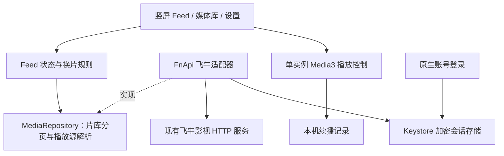

# 牛影随看：架构设计

状态：设计基线，已形成可构建实现并在 NAS Android 容器实际播放；完整验收边界以 VERIFICATION.md 最新记录为准。2026-09-20。

## 1. 产品边界与验收

这是一个连接现有飞牛影视服务的 Android 私人片库客户端。首版场景是手机与 NAS 处于可互通的局域网。

- 竖屏一屏一个视频，上滑下一条，下滑上一条；不是将长片剪辑成短视频。
- 默认完整显示画面；用户可切换裁剪铺满，不拉伸变形。
- 支持登录、选择媒体库、分页浏览、搜索、暂停、进度拖动、本机续播。
- NAS 是媒体目录、元数据和播放地址的权威来源。客户端不直接连接或修改数据库，不扫描 SMB，不重新建媒体库。
- 首版不包含上传、删除、云端推荐、公开分享、离线下载、后台播放、远程组网。

完成标准分开记录：源码可构建、APK 可安装、真实账号列出片库、原生播放器真实播放、上下滑与生命周期验证。网页播放成功仅证明 NAS 服务链路可用。

## 2. 已知事实与未决风险

服务地址由用户在原生登录页配置，入口通常为 `/v`；`LoginActivity` 通过 `FnApi.LoginCall` 完成密码登录，成功后由 `SessionStore` 保存加密会话。用户选择默认完整显示。

待验证：部署实例的鉴权与签名兼容性、媒体项到可播放文件的映射、真实多季电视剧分集层级、播放地址是否有短时效签名、转码会话的创建与释放、Android 解码兼容性。目录适配已经按已观察的 `/item/list` 与 `/search/list` 编写，但本轮没有把合成测试当成真实多季 NAS 验证；未知接口不扩散到 UI。

## 3. 技术方案与取舍

采用原生 Android 单应用，Java + AndroidX ViewPager2 + Media3 ExoPlayer。Java 是降低当前构建链和集成复杂度的工程选择；不影响后续逐模块迁移 Kotlin。首版单 Gradle app 模块，通过包与接口隔离职责，不引入没有独立发布需求的多模块工程。

相比把整个网页包进 WebView，原生播放器能明确控制手势、单播放器占用和 Android 生命周期。登录由原生连接表单承担，经 FnApi 调用已核对的影视密码接口；密码不持久化。相比新增 NAS 中转服务，直连现有服务不需要改 NAS 部署，但必须承担非公开 API 随版本变化的兼容风险。

## 4. 职责与依赖



- **Feed 状态**：当前查询、媒体库、条目、分页游标、当前项、请求代数；决定“哪条是当前项”，不认识飞牛 JSON 字段。
- **FeedPolicy**：Feed 可播放类型（电影、普通视频、分集）的唯一规则来源；`page(Query, cursor)` 继续使用这组类型，FeedState 执行目录项过滤。片库使用同一仓库的独立 `catalogPage(Query, cursor)`，按 `Query.kind` 请求作品类型（`Movie`、`TV`、`Video`），普通目录不混入 `Episode`。
- **飞牛适配器**：隐藏鉴权、签名、响应结构、分页及“媒体详情 → 文件 → 播放地址”的复杂性；向内返回简单模型。
- **播放控制**：唯一播放器实例，绑定当前页，处理暂停、seek、缩放、错误和资源释放；不自行查询片库。
- **会话存储**：加密保存令牌，保留服务器地址；不保存密码，不写入 Git、日志或 APK。退出清理令牌。
- **UI**：渲染状态和转发操作；不拼接 API 地址、不解析服务返回 JSON。

实现合并纯转发层。MainActivity 通过 MediaRepository 使用数据，只有组装处创建 FnApi；FeedState 与 FeedPolicy 不依赖 Android。MainActivity 仍负责较多界面组装和播放器生命周期编排，是首版的可维护性限制；后续扩展复杂播放策略前应提取相应控制器。

## 5. 核心契约

应用内契约（字段以真实接口验证结果适配，不要求服务器使用这些名称）：

```text
MediaRepository.libraries() -> List<Library>
MediaRepository.page(Query, cursor) -> Page(items, nextCursor)
MediaRepository.catalogPage(Query, cursor) -> Page(workItems, nextCursor)
MediaRepository.details(Video) -> Video       // defaults to the loaded model
MediaRepository.seriesEpisodes(Video) -> List<Video>
MediaRepository.resolve(Video) -> Source(url, headers, mimeType)
ResumeStore.read(MediaId) -> positionMillis
ResumeStore.write(MediaId, positionMillis)
SessionStore -> serverOrigin + encryptedToken
```

`Video` 包含稳定 ID、标题、副标题、封面、媒体类型，以及目录读取的 `overview`、字符串 `year`、`seriesId` 和 `seasonId`。`details(Video)` 不假定一个未核实的详情 HTTP 路由，默认返回已经从目录响应读到的模型。分集展开规则必须明确：一个 Feed 项应对应可播放文件；系列和 Season 目录不能直接当视频交给播放器。

Feed 与片库的边界如下：Feed 的 `page()` 面向可播放队列，保留 `Movie`、`Video`、`Episode` 语义；片库的 `catalogPage()` 面向作品地图，空 `kind` 返回 `Movie`、`TV`、`Video`，按 kind 可缩小到其中一种。搜索仍复用已观察的 `/search/list`，没有分页游标；all-kind 搜索保留无法可靠归并到系列的 Episode 命中，普通目录列表则排除 Episode。UI 与本地存储尚未因这份 API 契约自动获得新的页面或观看记录行为，本轮只记录已实现的适配边界。

`seriesEpisodes()` 先用 `parent_guid` 读取系列或 Season 的子项；遇到 Season 容器就继续读取该容器，按稳定 ID 去重并按季／集排序。只有收到可靠的总数、`has_more` 或短／空页边界才结束；重复页、冲突元数据、缺稳定 ID 和无法达到总数都返回明确失败。每个容器最多 512 页，遍历最多 16 层、2,048 个容器，避免失控递归或无界请求。真实 NAS 的多季层级和超过 50 条目录仍需集成验收。

`Source` 同时返回 URL 和请求头，避免读取“最近一次解析留下的请求头”造成并发串片。临时播放 URL 不持久化，每次重新激活视频时解析。错误区分登录失效、不可达、无权限、无文件、格式不支持和服务异常，UI 给出对应动作。

## 6. 播放与并发流程

1. 未登录显示原生连接页；用户选择局域网发现的服务或手填地址。FnApi 对密码作 SHA-256 后向指定源的 `/v/api/v2/user/loginByPassword` 提交 `username/password/app_name`，返回令牌仍由 SessionStore 加密保存；密码和哈希不持久化。拒绝认证请求重定向，关闭页面丢弃迟到结果。
2. 获取首批条目后显示 Feed；靠近末尾时请求下一页，按稳定 ID 去重。搜索或换库重置分页并增加请求代数。
3. 页面滚动结束后才激活新视频。保存旧位置，停止旧播放，再解析新项播放地址。
4. 所有网络工作离开主线程；异步结果只有在请求代数、当前媒体 ID 和会话仍匹配时才能应用。
5. 切后台暂停，回前台不覆盖用户主动暂停；退出释放播放器与请求。同一时间最多一个活动音视频播放器。
6. 播放错误支持显式重试；不无限自动重试，也不自动越过大量失败视频。会话失效导向重新登录。
7. Android 容器实测发现 HEVC 10-bit 超出设备解码能力。新增 `MediaRepository.resolveCompatible(Video)` 契约，由 FnApi 映射飞牛转码请求；UI 仅在解码错误或容器格式不支持时每页自动尝试一次，沿用异步代数和会话检查。正常设备仍先取原画，兼容失败保留错误供用户重试或换片。

首版预取元数据而不同时解码多个视频。长片、远程挂载与转码可能昂贵，待测得换片延迟后才决定预缓冲预算。

## 7. 安全与数据

仅需网络权限。允许用户已指定的局域网 HTTP；密码登录请求必须发往用户选择的服务，禁止忽略 TLS 错误或跟随重定向。API 认证头只发给 NAS；如果媒体 URL 跳到远程存储，必须审查重定向与认证头转发，避免泄漏 NAS 令牌。

已用 Media3 OkHttp 数据源的每次网络请求拦截器执行同源限制，跨域时清除 Authorization、Play-Link、Cookie 和 authx。User-Agent 与获取网盘直链时一致。Media3 的非稳定接口仅在三个播放适配类显式 OptIn，依赖固定版本；未关闭 lint 规则。

本机保存服务器、加密会话、显示偏好、按服务器和媒体 ID 隔离的续播位置。禁用 Android 数据备份。源码与 APK 不内置真实账号、登录令牌或用户片库快照。

## 8. 验证与实现顺序

1. **接口验证**：先核对登录、列表分页和一个播放源解析；存在不确定字段时记录，不扩散到 UI。
2. **最小纵向切片**：登录 → 第一页 → 一条普通影片的原生播放。此步通过后展开换片。
3. **Feed 行为**：快速连滑旧请求不能抢占新项；换库重置；翻页无重复；首尾有明确反馈。
4. **生命周期**：切后台无声音；恢复与主动暂停一致；退出释放资源；会话失效可重新登录。
5. **交付检查**：编译、静态检查、核心状态单测、可用设备上的安装与交互验证；没有真机/模拟器时明确未测项。

使用 clean-architecture 保持依赖方向，a-philosophy-of-software-design 约束接口深度，clean-code 与 code-complete 约束具体实现。避免为遵守层数而增加无价值包装。

技术依据：[Android 官方 Media3 播放器文档](https://developer.android.com/media/media3/exoplayer/hello-world)。依赖固定具体版本以获得可重复构建，不在构建时自动追随最新版本。

### 音轨兼容修正

当源包含音轨但设备没有支持的音轨时，Media3 可能继续播放画面而不触发致命错误。播放控制通过 Tracks 检测此状态，与解码错误共用每页一次的兼容回退；无音轨视频不触发回退。切换前停止旧源并保留当前位置，新的网络结果仍受代数、页面和仓库身份校验。兼容音轨仍不受支持时停止并显示错误，不循环转码。

FnApi 的兼容请求使用 AAC 并将声道限制为最多 2，保留单声道/无音轨语义。常规请求仍使用源音频参数。播放器设置媒体用途、电影内容类型和自动音频焦点，音量键控制媒体流，不改系统音量。公开仓库契约及 NAS 配置不变。

参考：[Android Media3 音轨选择](https://developer.android.com/media/media3/exoplayer/track-selection)。实际编译和设备测试针对固定 Media3 1.5.1。
